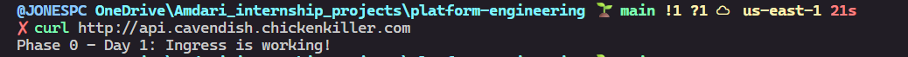

# Runbook — Phase 0: Reverse Proxy Foundations

## Overview

Phase 0 builds the manual reverse proxy and TLS stack on k3s over 3 days.
Every component you configure here has a direct EKS equivalent — doing it
manually first means you understand what the automation is hiding.

**Outcome**: A fully working HTTPS endpoint on a free subdomain, with IP
whitelisting and a demonstrated decommission pattern.

**Prerequisites**:

- AWS account (Free Tier eligible)
- SSH client
- Basic kubectl knowledge
- A browser for FreeDNS registration

---

## Day 1: k3s + Nginx Ingress + DNS

**Goal**: Route HTTP traffic from the public internet through a Kubernetes
Ingress resource to a container running inside k3s.

---

### Step 1: Launch an EC2 Instance

1. Log in to AWS Console → EC2 → Launch Instance

2. Configure:
   - **Name**: `k3s-phase0`
   - **AMI**: Ubuntu 22.04 LTS (Free Tier eligible)
   - **Instance type**: `t3.medium` (2 vCPU, 4 GB RAM — k3s needs headroom)
   - **Key pair**: Create a new one or use existing (e.g., `phase0-key.pem`)
   - **Network settings**:
     - Allow SSH (port 22) from your IP
     - Allow HTTP (port 80) from anywhere (`0.0.0.0/0`)
     - Allow HTTPS (port 443) from anywhere (`0.0.0.0/0`)
   - **Storage**: 20 GB gp3 (default 8 GB is tight for k3s)

3. Launch and wait for `Running` status.

4. Note your **Public IPv4 address** — you'll need it for DNS.

5. SSH into the instance:

   ```bash
   chmod 400 phase0-key.pem
   ssh -i phase0-key.pem ubuntu@<YOUR_EC2_PUBLIC_IP>
   ```

> **Why t3.medium?** k3s itself is lightweight, but Nginx Ingress Controller +
> cert-manager + your workloads together need ~2 GB RAM comfortably. t3.micro
> will OOM.

---

### Step 2: Install k3s (with Traefik disabled)

k3s ships with Traefik as the default Ingress controller. We disable it
because we're installing Nginx Ingress Controller manually — this mirrors
the EKS pattern where you choose your own Ingress controller.

```bash
# Install k3s without Traefik
curl -sfL https://get.k3s.io | INSTALL_K3S_EXEC="--disable traefik" sh -

# Verify k3s is running
sudo systemctl status k3s

# Set up kubectl access (k3s bundles kubectl)
mkdir -p ~/.kube
sudo cp /etc/rancher/k3s/k3s.yaml ~/.kube/config
sudo chown $(id -u):$(id -g) ~/.kube/config
export KUBECONFIG=~/.kube/config

# Add to bashrc so it persists
echo 'export KUBECONFIG=~/.kube/config' >> ~/.bashrc

# Verify cluster is ready
kubectl get nodes
```

**Expected output**:

```plaintext
NAME          STATUS   ROLES                  AGE   VERSION
ip-x-x-x-x    Ready    control-plane,master   13m   v1.35.5+k3s1
```

**Verify Traefik is NOT running**:

```bash
kubectl get pods -n kube-system | grep traefik
# Should return nothing

# or count the traefik pods
kubectl get pods -n kube-system --no-headers | grep traefik | wc -l
```

```bash
0
```

> **Understanding**: On EKS, the control plane is managed by AWS. Here we see
> it all — etcd, API server, scheduler — running as a single binary. This is
> what AWS hides.

---

### Step 3: Install Helm

Helm is the package manager for Kubernetes. We'll use it to install Nginx
Ingress Controller (and cert-manager on Day 2).

```bash
# Install Helm
curl https://raw.githubusercontent.com/helm/helm/main/scripts/get-helm-3 | bash

# Verify
helm version
```

**Expected output**:

```plaintext
version.BuildInfo{Version:"v3.x.x", ...}
```

---

### Step 4: Install Nginx Ingress Controller via Helm

```bash
# Add the ingress-nginx Helm repo
helm repo add ingress-nginx https://kubernetes.github.io/ingress-nginx
helm repo update

# Install Nginx Ingress Controller
helm install ingress-nginx ingress-nginx/ingress-nginx \
  --namespace ingress-nginx \
  --create-namespace \
  --set controller.hostNetwork=true \
  --set controller.service.type=ClusterIP \
  --set controller.ingressClassResource.default=true \
  --set controller.kind=DaemonSet
```

> **Why `hostNetwork: true` with `ClusterIP`?** On a single-node k3s cluster,
> we need the Ingress Controller to bind directly to the host's port 80/443.
> NodePort won't work because ports 80/443 are outside the valid NodePort range
> (30000-32767). With hostNetwork the Pod itself listens on the host's network
> interface — no Service routing needed. On EKS, the AWS Load Balancer
> Controller handles this by provisioning an ALB instead.

**Verify the Ingress Controller is running**:

```bash
kubectl get pods -n ingress-nginx
```

**Expected output**:

```plaintext
NAME                                        READY   STATUS    RESTARTS   AGE
ingress-nginx-controller-xxxxxxxxx-xxxxx    1/1     Running   0          60s
```

**Verify the IngressClass is registered**:

```bash
kubectl get ingressclass
```

**Expected output**:

```plaintext
NAME    CONTROLLER             PARAMETERS   AGE
nginx   k8s.io/ingress-nginx   <none>       60s
```

> **Understanding**: The IngressClass tells Kubernetes which controller handles
> a given Ingress resource. On EKS, this will be `alb` instead of `nginx`. The
> concept is identical — only the controller changes.

---

### Step 5: Register a Free DNS Subdomain (FreeDNS)

You need a real domain name pointing to your EC2 IP so that:

- HTTP routing by hostname works
- Let's Encrypt can issue a certificate (Day 2)

1. Go to [https://freedns.afraid.org](https://freedns.afraid.org)
2. Create a free account (confirm email)
3. Navigate to **Subdomains** → **Add a subdomain**
4. Configure:
   - **Type**: A
   - **Subdomain**: `api` (or any name you prefer)
   - **Domain**: Choose one from the public list (e.g., `mooo.com`, `us.to`,
     `chickenkiller.com`)
   - **Destination**: Your EC2 public IP address
5. Save

Your subdomain will be something like: `api.dnsname.mooo.com`

**Verify DNS is resolving** (may take 1–5 minutes):

```bash
# From your local machine or the EC2 instance
nslookup api.dnsname.mooo.com
# or
dig api.dnsname.mooo.com +short
```

**Expected output**: Your EC2 public IP address.

> **Understanding**: On EKS, ExternalDNS automates this. It watches Ingress
> annotations and creates Route 53 records via the AWS API. Phase 0 shows you
> the manual step that ExternalDNS replaces.

---

### Step 6: Deploy a Placeholder Application

Deploy a simple HTTP echo service to have something to route traffic to.

```bash
# Create the deployment
cat <<EOF | kubectl apply -f -
apiVersion: apps/v1
kind: Deployment
metadata:
  name: http-echo
spec:
  replicas: 1
  selector:
    matchLabels:
      app: http-echo
  template:
    metadata:
      labels:
        app: http-echo
    spec:
      containers:
        - name: http-echo
          image: hashicorp/http-echo
          args:
            - "-text=Phase 0 - Day 1: Ingress is working!"
          ports:
            - containerPort: 5678
---
# Expose it as a ClusterIP service
apiVersion: v1
kind: Service
metadata:
  name: http-echo
spec:
  selector:
    app: http-echo
  ports:
    - port: 80
      targetPort: 5678
EOF

# Verify
kubectl get pods
kubectl get svc http-echo
```

**Expected output** (pods):

```plaintext
NAME                        READY   STATUS    RESTARTS   AGE
http-echo-xxxxxxxxx-xxxxx   1/1     Running   0          30s
```

**Expected output** (service):

```plaintext
NAME        TYPE        CLUSTER-IP     EXTERNAL-IP   PORT(S)   AGE
http-echo   ClusterIP   10.43.x.x     <none>        80/TCP    10s
```

> **Understanding**: The service has no external IP — it's only reachable
> inside the cluster. The Ingress resource (next step) connects external
> traffic to this internal service.

---

### Step 7: Create the Ingress Resource

Create a file for the Ingress manifest. This is the core Kubernetes resource
that defines routing rules.

```bash
cat <<EOF | kubectl apply -f -
apiVersion: networking.k8s.io/v1
kind: Ingress
metadata:
  name: http-echo-ingress
  annotations:
    nginx.ingress.kubernetes.io/rewrite-target: /
spec:
  ingressClassName: nginx
  rules:
    - host: api.dnsname.mooo.com    # <-- Replace with THE subdomain
      http:
        paths:
          - path: /
            pathType: Prefix
            backend:
              service:
                name: http-echo
                port:
                  number: 80
EOF
```

> **Replace** `api.yourname.mooo.com` with your actual FreeDNS subdomain.

**Verify the Ingress was created**:

```bash
kubectl get ingress
```

**Expected output**:

```plaintext
NAME                CLASS   HOSTS                      ADDRESS        PORTS   AGE
http-echo-ingress   nginx   api.dnsname.chickenkiller.com      <EC2_IP>       80      10s
```

**Examine it in detail**:

```bash
kubectl describe ingress http-echo-ingress
```

This shows:

- The Host rule
- The backend service and port
- The IngressClass being used
- Events from the Nginx controller picking up the resource

> **Understanding**: This Ingress resource is a *declaration* — "route traffic
> for this hostname to this service." The Nginx Ingress Controller *watches*
> for these resources and translates them into actual Nginx config. On EKS, the
> AWS Load Balancer Controller watches for the same resources but creates ALB
> listener rules instead.

---

### Step 8: Test the Routing

```bash
# From your local machine (not the EC2 instance)
curl http://api.dnsname.mooo.com
```

**Expected output**:

```plaintext
Phase 0 - Day 1: Ingress is working!
```

Evidence from local CLI:



If it works, congratulations — traffic is flowing:

```plaintext
Browser/curl → DNS → EC2 public IP:80 → Nginx Ingress Controller → http-echo Pod
```

**Troubleshooting** (if curl fails):

| Symptom | Likely Cause | Fix |
| --------- | ------------- | ----- |
| `Connection refused` | EC2 security group not open on port 80 | Add inbound rule: HTTP (80) from 0.0.0.0/0 |
| `Connection timed out` | DNS not resolved or wrong IP | Run `dig api.yourname.mooo.com` — check IP matches EC2 |
| `404 Not Found` | Ingress host doesn't match request | Check `host:` in Ingress matches your subdomain exactly |
| `502 Bad Gateway` | Backend service not running | Run `kubectl get pods` — check http-echo is Running |
| `503 Service Unavailable` | Ingress controller not ready | Run `kubectl get pods -n ingress-nginx` — wait for Running |

---

### Step 9: Documentation

Save the evidence for your deliverable:

```bash
# Save the Ingress manifest
kubectl get ingress http-echo-ingress -o yaml > ~/ingress-day1.yaml

# Save the curl output with timestamp
echo "=== P0-D1 Verification ===" > ~/phase0-day1-evidence.txt
echo "Timestamp: $(date -u '+%Y-%m-%d %H:%M:%S UTC')" >> ~/phase0-day1-evidence.txt
echo "" >> ~/phase0-day1-evidence.txt
echo "--- curl output ---" >> ~/phase0-day1-evidence.txt
curl -v http://api.yourname.mooo.com >> ~/phase0-day1-evidence.txt 2>&1
echo "" >> ~/phase0-day1-evidence.txt
echo "--- kubectl get ingress ---" >> ~/phase0-day1-evidence.txt
kubectl get ingress >> ~/phase0-day1-evidence.txt
echo "" >> ~/phase0-day1-evidence.txt
echo "--- kubectl describe ingress ---" >> ~/phase0-day1-evidence.txt
kubectl describe ingress http-echo-ingress >> ~/phase0-day1-evidence.txt

# Review your evidence
cat ~/phase0-day1-evidence.txt
```

---

### Day 1 — Deliverable Checklist (P0-D1)

| # | Check | Command | Expected |
| --- | ------- | --------- | ---------- |
| 1 | k3s node is Ready | `kubectl get nodes` | STATUS: Ready |
| 2 | Traefik is NOT running | `kubectl get pods -n kube-system \| grep traefik` | No output |
| 3 | Nginx Ingress Controller is Running | `kubectl get pods -n ingress-nginx` | 1/1 Running |
| 4 | IngressClass `nginx` exists | `kubectl get ingressclass` | nginx listed |
| 5 | DNS resolves to EC2 IP | `dig api.yourname.mooo.com +short` | Your EC2 IP |
| 6 | Ingress shows Address | `kubectl get ingress` | ADDRESS = EC2 IP |
| 7 | curl returns 200 from container | `curl http://api.yourname.mooo.com` | Response text from http-echo |

#### All 7 checks pass = Day 1 complete ✅

---

### What Was Covered In This Exercise

After Day 1, we've been exposed to:

1. **What an Ingress Controller does** — it watches for Ingress resources and
   translates them into actual routing rules (Nginx config, ALB listener rules,
   etc.)
2. **What an IngressClass is** — it tells Kubernetes *which* controller should
   handle a given Ingress resource
3. **Why DNS matters** — without a DNS record pointing to the load balancer
   (or node), hostname-based routing has nowhere to land
4. **The traffic flow** — `client → DNS → IP:80 → Ingress Controller →
   Service → Pod`

### EKS Mapping

| What we did manually | What EKS does instead |
| ----------------------- | ----------------------- |
| Installed Nginx Ingress Controller via Helm | AWS Load Balancer Controller provisions an ALB |
| Registered a FreeDNS A record manually | ExternalDNS creates Route 53 records from Ingress annotations |
| Used `hostNetwork: true` to bind port 80 | ALB handles external traffic — no host binding needed |
| IngressClass: `nginx` | IngressClass: `alb` |

### Future Note: Gateway API

CNCF has graduated Gateway API as the successor to Ingress. Ingress is stable
and widely deployed in production, but frozen — no new features will be added.
For this project, we used Ingress because the ecosystem (ArgoCD, Helm charts,
AWS LB Controller documentation) is still predominantly Ingress-based.

The core concept we learned in Day 1 remains identical in Gateway API — the
difference is how responsibilities are split:

| Ingress (what we use) | Gateway API (successor) | Same concept? |
| ----------------------- | ------------------------- | --------------- |
| Ingress resource | HTTPRoute resource | ✅ Same — "route this host to this service" |
| IngressClass | GatewayClass | ✅ Same — "which controller handles this" |
| One resource, one owner | Gateway (platform) + HTTPRoute (app team) | Split ownership model |

AWS Load Balancer Controller supports both Ingress and Gateway API — the ALB
it provisions is identical either way. When the broader ecosystem fully
migrates, we can adopt Gateway API with zero infrastructure changes. For now,
Ingress is the pragmatic production choice.

---

## Day 2: cert-manager + Let's Encrypt HTTPS

<!-- To be completed on Day 2 -->

---

## Day 3: IP Restriction + Decommission Pattern

<!-- To be completed on Day 3 -->
