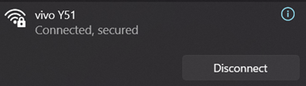

# Runbook — Phase 0 Day 3: IP Restriction + Decommission Pattern

## Goal

Demonstrate network-level access control at the Ingress layer and the
decommission pattern (delete Ingress → service becomes unreachable, restore →
service returns). These are the exact operational patterns we'll use throughout
the EKS project.

---

## What We're Building

```plaintext
Allowed IP (our home/office)
       │
       ▼
┌──────────────────────────────────────┐
│  Nginx Ingress Controller            │
│  whitelist-source-range annotation   │──→ HTTP 200 ✅
│                                      │
└──────────────────────────────────────┘

Blocked IP (VPN / mobile data / any other IP)
       │
       ▼
┌──────────────────────────────────────┐
│  Nginx Ingress Controller            │
│  whitelist-source-range annotation   │──→ HTTP 403 🚫
│                                      │
└──────────────────────────────────────┘

Ingress deleted
       │
       ▼
┌──────────────────────────────────────┐
│  Nginx Ingress Controller            │
│  No matching rule                    │──→ HTTP 404 ❌
│                                      │
└──────────────────────────────────────┘
```

---

## Prerequisites (from Day 1 + Day 2)

- ✅ HTTPS working: `curl -I https://api.cavendish.chickenkiller.com` → 200
- ✅ Certificate: Ready: True
- ✅ Ports 80 + 443 open in security group

---

## Part 1: IP Restriction

### Step 1: Find Our Public IP

```bash
# From our local machine (not EC2)
curl ifconfig.me
```

Note this IP — it's what we'll whitelist.

---

### Step 2: Apply the Whitelist Annotation

Update the Ingress to only allow traffic from our IP:

```bash
cat <<EOF | kubectl apply -f -
apiVersion: networking.k8s.io/v1
kind: Ingress
metadata:
  name: http-echo-ingress
  annotations:
    nginx.ingress.kubernetes.io/rewrite-target: /
    cert-manager.io/cluster-issuer: letsencrypt-prod
    nginx.ingress.kubernetes.io/whitelist-source-range: "YOUR_LOCAL_IP/32"
spec:
  ingressClassName: nginx
  tls:
    - hosts:
        - api.cavendish.chickenkiller.com
      secretName: http-echo-tls
  rules:
    - host: api.cavendish.chickenkiller.com
      http:
        paths:
          - path: /
            pathType: Prefix
            backend:
              service:
                name: http-echo
                port:
                  number: 80
EOF
```

> **Replace** `YOUR_LOCAL_IP/32` with our actual public IP from Step 1 (e.g.,
> `82.45.123.67/32`). The `/32` means "this exact IP only."
---

**output**:

```plaintext
ingress.networking.k8s.io/http-echo-ingress configured
```

### Step 3: Test from Allowed IP

```bash
# From our local machine (the IP we whitelisted)
curl -I https://api.cavendish.chickenkiller.com
```

**Expected output**:

```plaintext
HTTP/2 200
```

✅ We're allowed through.

---

### Step 4: Test from a Blocked IP

Switch to a different IP to simulate an unauthorized client:

- Use a VPN
- Use mobile data (disconnect from WiFi)
- Or SSH into the EC2 and curl from there (EC2's IP is different from ours)

**Connected to a mobile data**:



```bash
# From EC2 (its IP isn't whitelisted)
curl -I https://api.cavendish.chickenkiller.com
```

**Expected output**:

```plaintext
HTTP/2 403 Forbidden
```

🚫 Blocked. The Ingress Controller rejected the request at the reverse proxy
layer before it ever reached our application.

> **Understanding**: On EKS, this maps to ALB's
> `alb.ingress.kubernetes.io/inbound-cidrs` annotation — same concept,
> different annotation key. The ALB security group rules achieve the same
> effect at the AWS networking layer.

---

## Part 2: Decommission Pattern

This demonstrates that removing an Ingress immediately makes a service
unreachable — and restoring it brings it back. This is how we'll manage
service lifecycle throughout the EKS project.

### Step 5: Save the Current Ingress Manifest

```bash
kubectl get ingress http-echo-ingress -o yaml > ~/ingress-backup.yaml
```

---

### Step 6: Delete the Ingress

```bash
kubectl delete ingress http-echo-ingress
```

**Verify it's gone**:

```bash
kubectl get ingress
```

**Expected output**:

```plaintext
No resources found in default namespace.
```

---

### Step 7: Test — Service Should Be Unreachable

```bash
# From our local machine
curl -I https://api.cavendish.chickenkiller.com
```

**Expected output**:

```plaintext
HTTP/2 404
```

Or a connection timeout/refused — depends on timing. The point: the subdomain
no longer routes to anything. The DNS record still exists (FreeDNS hasn't
changed), but there's no Ingress rule telling Nginx where to send traffic.

> **Key insight**: We didn't touch DNS, didn't modify the application, didn't
> delete the Pod. We only removed the routing rule. That's sufficient to make
> a service unreachable. On EKS with ArgoCD, deleting the Ingress from Git
> achieves the same — ArgoCD syncs the deletion and the ALB listener rule
> disappears.

---

### Step 8: Restore the Ingress

```bash
# Re-apply from our backup (remove the whitelist for now to make testing easier)
cat <<EOF | kubectl apply -f -
apiVersion: networking.k8s.io/v1
kind: Ingress
metadata:
  name: http-echo-ingress
  annotations:
    nginx.ingress.kubernetes.io/rewrite-target: /
    cert-manager.io/cluster-issuer: letsencrypt-prod
spec:
  ingressClassName: nginx
  tls:
    - hosts:
        - api.cavendish.chickenkiller.com
      secretName: http-echo-tls
  rules:
    - host: api.cavendish.chickenkiller.com
      http:
        paths:
          - path: /
            pathType: Prefix
            backend:
              service:
                name: http-echo
                port:
                  number: 80
EOF
```

---

### Step 9: Verify Service Is Back

```bash
curl -I https://api.cavendish.chickenkiller.com
```

**Expected output**:

```plaintext
HTTP/2 200 OK
```

✅ Service restored. The TLS certificate (stored in the `http-echo-tls`
secret) was never deleted — only the routing rule was removed and re-added.

---

## Step 10: Documentation

```bash
echo "=== P0-D3 Verification ===" > ~/phase0-day3-evidence.txt
echo "Timestamp: $(date -u '+%Y-%m-%d %H:%M:%S UTC')" >> ~/phase0-day3-evidence.txt
echo "" >> ~/phase0-day3-evidence.txt

echo "--- IP Restriction: Allowed IP (200) ---" >> ~/phase0-day3-evidence.txt
curl -I https://api.cavendish.chickenkiller.com >> ~/phase0-day3-evidence.txt 2>&1
echo "" >> ~/phase0-day3-evidence.txt

echo "--- Decommission: Delete Ingress ---" >> ~/phase0-day3-evidence.txt
kubectl delete ingress http-echo-ingress >> ~/phase0-day3-evidence.txt 2>&1
echo "" >> ~/phase0-day3-evidence.txt

echo "--- Decommission: Confirm 404 ---" >> ~/phase0-day3-evidence.txt
sleep 2
curl -I https://api.cavendish.chickenkiller.com >> ~/phase0-day3-evidence.txt 2>&1
echo "" >> ~/phase0-day3-evidence.txt

echo "--- Restore: Re-apply Ingress ---" >> ~/phase0-day3-evidence.txt
cat <<EOF | kubectl apply -f - >> ~/phase0-day3-evidence.txt 2>&1
apiVersion: networking.k8s.io/v1
kind: Ingress
metadata:
  name: http-echo-ingress
  annotations:
    nginx.ingress.kubernetes.io/rewrite-target: /
    cert-manager.io/cluster-issuer: letsencrypt-prod
spec:
  ingressClassName: nginx
  tls:
    - hosts:
        - api.cavendish.chickenkiller.com
      secretName: http-echo-tls
  rules:
    - host: api.cavendish.chickenkiller.com
      http:
        paths:
          - path: /
            pathType: Prefix
            backend:
              service:
                name: http-echo
                port:
                  number: 80
EOF
echo "" >> ~/phase0-day3-evidence.txt

echo "--- Restore: Confirm 200 ---" >> ~/phase0-day3-evidence.txt
sleep 3
curl -I https://api.cavendish.chickenkiller.com >> ~/phase0-day3-evidence.txt 2>&1

cat ~/phase0-day3-evidence.txt
```

---

## Day 3 — Deliverable Checklist (P0-D3)

| # | Check | Expected |
| --- | ------- | ---------- |
| 1 | Whitelisted IP → HTTPS request | HTTP 200 |
| 2 | Non-whitelisted IP → HTTPS request | HTTP 403 |
| 3 | Delete Ingress → HTTPS request | HTTP 404 or connection refused |
| 4 | Restore Ingress → HTTPS request | HTTP 200 |
| 5 | Evidence committed to repo | `phase0-day3-evidence.txt` in `/runbooks/phase-0-day-3/` |

**All 5 checks pass = `Day 3` complete ✅**

---

## What We Now Understand

After Day 3, we can explain:

1. **IP restriction at the reverse proxy layer** — the Ingress Controller
   checks source IP *before* forwarding to the backend. The application never
   sees blocked requests.
2. **The decommission pattern** — removing a routing rule is sufficient to
   make a service unreachable. We don't need to delete Pods, Services, or DNS
   records.
3. **Idempotent infrastructure** — we deleted and restored the Ingress with
   `kubectl apply`. The certificate persisted in the Secret. This is the same
   pattern ArgoCD uses — desired state in Git, reconciled continuously.
4. **Separation of concerns** — DNS, TLS, and routing are independent layers.
   We can change one without touching the others.

## EKS Mapping

| What we did manually | What EKS does instead |
| ----------------------- | ----------------------- |
| `whitelist-source-range` annotation | `alb.ingress.kubernetes.io/inbound-cidrs` annotation |
| `kubectl delete ingress` to decommission | Remove from Git → ArgoCD syncs the deletion |
| `kubectl apply` to restore | Commit to Git → ArgoCD syncs the restoration |
| Manual verification of 403/404/200 | NetworkPolicy + ALB rules enforce at multiple layers |

---

## Phase 0 Complete 🎉

All three days are done. We've built the full reverse proxy + TLS + access
control stack manually. Every concept maps directly to what we'll automate on
EKS:

| Day | What we proved | EKS equivalent |
| ----- | ---------------- | ---------------- |
| Day 1 | Ingress routing + DNS | ALB Controller + ExternalDNS + Route 53 |
| Day 2 | TLS certificate lifecycle | ACM (zero-config, auto-renew) |
| Day 3 | IP restriction + decommission | ALB inbound-cidrs + ArgoCD GitOps |

Next step: **Week 1 — Terraform + EKS provisioning.** We now understand
*exactly* what the AWS automation is doing under the hood.
